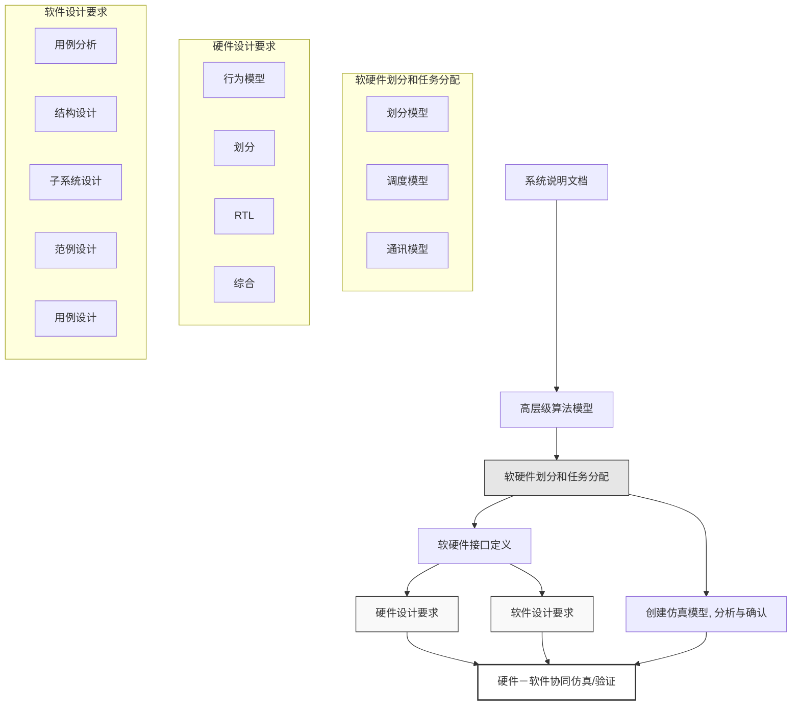

## 基于HDL的数字IC设计流程

```mermaid

graph TD
    A[系统说明文档] --> B[高层级算法模型]
    B --> C[软硬件划分和任务分配]
    C --> D[创建仿真模型, 分析与确认]
    C --> E[软硬件接口定义]

    subgraph 软硬件划分和任务分配
        C1[划分模型]
        C2[调度模型]
        C3[通讯模型]
    end

    E --> F[硬件设计要求]
    E --> G[软件设计要求]

    subgraph 硬件设计要求
        F1[行为模型]
        F2[划分]
        F3[RTL]
        F4[综合]
    end

    subgraph 软件设计要求
        G1[用例分析]
        G2[结构设计]
        G3[子系统设计]
        G4[范例设计]
        G5[用例设计]
    end

    F --> H[硬件－软件协同仿真/验证]
    G --> H
    D --> H

    style C fill:#e6e6e6,stroke:#333
    style F fill:#f9f9f9,stroke:#333
    style G fill:#f9f9f9,stroke:#333
    style H fill:#fff,stroke:#333,stroke-width:2px

```

## IC性能指标定义

- 物理指标
  - 制作工艺
  - 裸片面积
  - 封装形式
- 性能指标
  - 速度
  - 功耗
  - 准确率
- 功能指标
  - 供能描述
  - 接口定义
