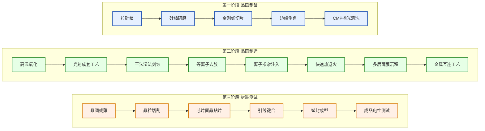
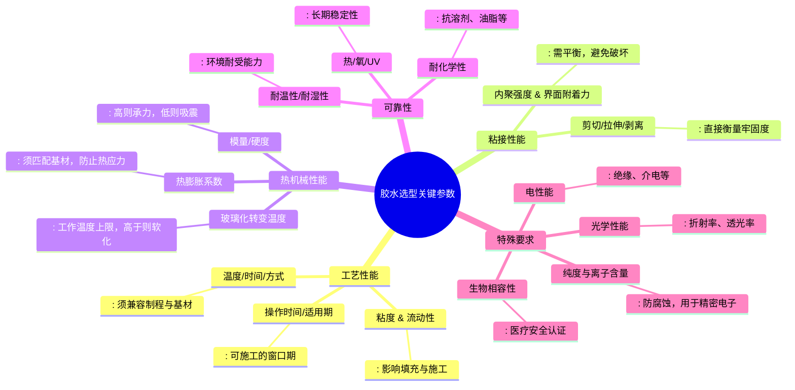

# 系统

## 半导体工艺流程

## 一、晶圆制备阶段

**目的**：将多晶硅提纯并加工成高质量、表面平整的单晶硅片，作为集成电路的衬底。

| 步骤        | 说明                                                 | 目的                                       | 常用方法/设备                         |
| ----------- | ---------------------------------------------------- | ------------------------------------------ | ------------------------------------- |
| 拉硅棒      | 通过直拉法（CZ）或区熔法（FZ）生长单晶硅棒           | 获得高纯度、低缺陷、定向生长的单晶硅       | 单晶炉（信越、SUMCO、沪硅产业）       |
| 硅棒研磨    | 对硅棒外圆进行磨削，使其直径均匀                     | 控制硅棒直径与圆柱度，便于后续加工         | 外圆研磨机（Disco、赫瑞特）           |
| 金刚线切片  | 用金刚线将硅棒切割成薄片（晶圆）                     | 获得厚度一致的硅片，提高材料利用率         | 金刚线切割机（Disco、高测股份）       |
| 边缘倒角    | 对硅片边缘进行磨削、抛光，形成光滑圆弧               | 防止边缘崩裂、降低后续工艺中的应力集中     | 边缘倒角机（Disco、盛美上海）         |
| CMP抛光清洗 | 通过化学机械抛光使硅片表面达到原子级平整，并进行清洗 | 去除表面损伤层、污染物，获得超平整洁净表面 | CMP设备、清洗机（应用材料、华海清科） |

## 二、晶圆制造阶段（前道工艺）

**目的**：在晶圆表面通过一系列工序制造出晶体管、电容、电阻等元件，并实现多层互连结构。

| 步骤          | 说明                                           | 目的                         | 常用方法/设备                            |
| ------------- | ---------------------------------------------- | ---------------------------- | ---------------------------------------- |
| 高温氧化      | 在高温下使硅表面生成二氧化硅层                 | 形成绝缘层、钝化层、掩模层等 | 氧化炉（东京电子、北方华创）             |
| 光刻成套工艺  | 涂胶 → 曝光 → 显影，将掩模版图形转移到光刻胶上 | 定义集成电路的微细图形       | 光刻机（ASML、上海微电子）、涂胶显影机   |
| 干法/湿法刻蚀 | 利用化学或物理方法去除未保护区域的材料         | 将光刻胶图形转移到下层材料   | 干法刻蚀机（泛林、中微公司）、湿法刻蚀槽 |
| 等离子去胶    | 使用等离子体去除残留光刻胶                     | 清洁表面，为后续工艺做准备   | 去胶机（Screen、盛美上海）               |
| 离子掺杂/注入 | 将杂质离子注入硅中，改变局部电学特性           | 形成源/漏区、阱区等掺杂区域  | 离子注入机（亚舍立、中科信）             |
| 快速热退火    | 短时间高温处理，激活注入杂质并修复晶格损伤     | 提高载流子活性，恢复晶体结构 | RTA设备（应用材料、北方华创）            |
| 多层薄膜沉积  | 沉积绝缘层、金属层等多层薄膜                   | 形成隔离层、导电层、钝化层等 | PVD、CVD、ALD设备（拓荆科技、泛林）      |
| 金属互连工艺  | 通过光刻、刻蚀、沉积等形成多层金属连线         | 实现晶体管之间的电学连接     | 溅射台、电镀设备（应用材料、盛美上海）   |

## 三、封装测试阶段（后道工艺）

**目的**：将制造好的芯片从晶圆上分离，进行封装保护，并进行电性测试，最终形成可用的半导体器件。

| 步骤         | 说明                                   | 目的                             | 常用方法/设备                        |
| ------------ | -------------------------------------- | -------------------------------- | ------------------------------------ |
| 晶圆减薄     | 从背面研磨晶圆，降低厚度               | 提高散热性能、适应薄型封装需求   | 减薄机（Disco、华海清科）            |
| 晶粒切割     | 将晶圆切割成单个芯片（Die）            | 分离芯片，便于后续封装           | 划片机（Disco、高测股份）            |
| 芯片固晶贴片 | 将芯片粘贴到封装基板或引线框架上       | 固定芯片，提供机械支撑与散热路径 | 固晶贴片机（ASM、长川科技）          |
| 引线键合     | 用金属线连接芯片焊盘与封装引脚         | 实现芯片与外部电路的电学连接     | 引线键合机（K&S、北方华创）          |
| 塑封成型     | 用环氧树脂等材料包裹芯片，形成保护壳体 | 提供机械保护、散热、绝缘         | 塑封机、切筋机（长电科技、通富微电） |
| 成品电性测试 | 对封装后的芯片进行功能与参数测试       | 筛选合格品，保证器件性能与可靠性 | 探针台、测试机（泰瑞达、华峰测控）   |

## 补充说明

| 步骤          | 说明                                           | 目的                         | 作用层/材料                    | 技术难点                                                                                   | 可能引入的杂质元素                                                                                   |
| ------------- | ---------------------------------------------- | ---------------------------- | ------------------------------ | ------------------------------------------------------------------------------------------ | ---------------------------------------------------------------------------------------------------- |
| 高温氧化      | 在高温下使硅表面生成二氧化硅层                 | 形成绝缘层、钝化层、掩模层等 | 硅表面 → SiO₂                  | 1. 氧化层厚度均匀性控制 2. 界面态密度降低 3. 氧化层致密性 4. 热应力管理           | 1. 钠离子(Na⁺)迁移 2. 重金属离子(Cu、Fe)污染 3. 碳(C)杂质 4. 氢(H)相关缺陷                  |
| 光刻成套工艺  | 涂胶 → 曝光 → 显影，将掩模版图形转移到光刻胶上 | 定义集成电路的微细图形       | 光刻胶（临时层）               | 1. 纳米级图形分辨率 2. 套刻精度控制 3. 边缘粗糙度(LER)控制 4. EUV光刻随机缺陷     | 1. 光刻胶有机残留物 2. 金属催化剂污染 3. 抗反射涂层杂质 4. 显影液离子污染                   |
| 干法/湿法刻蚀 | 利用化学或物理方法去除未保护区域的材料         | 将光刻胶图形转移到下层材料   | SiO₂、SiN、多晶硅、金属等      | 1. 高深宽比刻蚀(>60:1) 2. 刻蚀选择比控制 3. 侧壁形貌控制 4. 刻蚀负载效应          | 1. 卤素元素(F、Cl)残留 2. 聚合物沉积物 3. 金属污染物 4. 碳氢化合物污染                      |
| 等离子去胶    | 使用等离子体去除残留光刻胶                     | 清洁表面，为后续工艺做准备   | 残留光刻胶                     | 1. 彻底去除不损伤下层材料 2. 等离子体均匀性 3. 静电放电(ESD)防护 4. 残留物控制    | 1. 氧等离子体引入的氧缺陷 2. 碳氢化合物残留 3. 金属污染物再沉积 4. 氟(F)、氯(Cl)残留        |
| 离子掺杂/注入 | 将杂质离子注入硅中，改变局部电学特性           | 形成源/漏区、阱区等掺杂区域  | 硅衬底（注入B、P、As等）       | 1. 超浅结形成(<10nm) 2. 掺杂均匀性控制 3. 沟道效应抑制 4. 高能注入损伤修复        | 1. 注入元素(B、P、As)扩散 2. 重金属离子(Fe、Cu)污染 3. 碳(C)、氧(O)杂质 4. 氟(F)来自BF₂注入 |
| 快速热退火    | 短时间高温处理，激活注入杂质并修复晶格损伤     | 提高载流子活性，恢复晶体结构 | 掺杂区域的硅晶格               | 1. 超快速热预算控制 2. 温度均匀性(±5℃以内) 3. 杂质激活与扩散平衡 4. 热应力控制    | 1. 快速扩散杂质 2. 氧(O)、氮(N)扩散 3. 金属污染物扩散 4. 氢(H)钝化/去钝化                   |
| 多层薄膜沉积  | 沉积绝缘层、金属层等多层薄膜                   | 形成隔离层、导电层、钝化层等 | SiO₂、SiN、Al、Cu、W、Ti/TiN等 | 1. 原子级厚度控制(ALD) 2. 台阶覆盖性(>95%) 3. 薄膜应力控制 4. 低介电常数(k值)实现 | 1. 前驱体残留(Cl、F、C、H) 2. 金属杂质扩散 3. 氧(O)、氮(N)非理想计量比 4. 氢(H)相关键合缺陷 |
| 金属互连工艺  | 通过光刻、刻蚀、沉积等形成多层金属连线         | 实现晶体管之间的电学连接     | Al、Cu等金属布线层             | 1. 铜电镀空洞缺陷控制 2. 电迁移寿命提升 3. 低k介质集成 4. 化学机械抛光(CMP)均匀性 | 1. 电镀液有机添加剂 2. 阻挡层元素扩散(Ti、Ta) 3. 氧(O)、氮(N)杂质 4. 碳(C)残留物            |

---

## 胶水选择

# 胶水选型关键参数指南

| 类别           | 关键参数             | 描述与要求                                                                                                                    |
| -------------- | -------------------- | ----------------------------------------------------------------------------------------------------------------------------- |
| **工艺性能**   | 温度/时间/方式       | 固化温度、时间及方式（热固化、UV固化、湿气固化等）必须与现有制程和设备兼容，且不损伤被粘接基材                                |
|                | 粘度与流动性         | 影响胶水的填充、渗透和施工性能。需根据填充间隙、点胶/涂布方式选择合适粘度                                                     |
|                | 操作时间/适用期      | 混合后或开封后保持可施工状态的窗口期。需匹配产线节拍，避免过早固化                                                            |
| **粘接性能**   | 剪切/拉伸/剥离强度   | 直接衡量胶层牢固度的核心力学指标，需满足产品在预期载荷下的安全要求                                                            |
|                | 内聚强度与界面附着力 | 内聚强度指胶体自身强度，界面附着力指胶体与基材的结合力。二者需平衡，避免内聚破坏或界面脱粘                                    |
| **热机械性能** | 玻璃化转变温度       | 胶体从"玻璃态"转变为"高弹态"的临界温度。**工作温度必须低于Tg**，否则胶体软化，强度与模量骤降，失去保护作用                    |
|                | 模量/硬度            | 反映材料抵抗变形的能力。高模量（硬胶）承力好，尺寸稳定；低模量（软胶）更能吸收应力、缓冲震动，适合柔性或异质材料连接          |
|                | 热膨胀系数           | 材料受热后膨胀的程度。**必须与所粘接的基材（如硅芯片、陶瓷、PCB、焊料）匹配**，否则温度变化会产生热应力，导致开裂、翘曲或脱粘 |
| **可靠性**     | 耐温性/耐湿性        | 在高温高湿环境下保持性能稳定的能力。尤其对于户外、汽车、航空航天等严苛环境应用至关重要                                        |
|                | 耐热氧/UV老化性      | 抵抗长期热、氧气、紫外线等作用导致的性能衰减（如变脆、变色、强度下降）的能力                                                  |
|                | 耐化学性             | 抵抗溶剂、油脂、酸、碱等化学品侵蚀的能力，确保在特定使用环境中性能稳定                                                        |
| **特殊要求**   | 电性能               | 包括绝缘电阻、介电常数、介电损耗、击穿电压等。对于电子封装，通常要求高绝缘、低介电常数和损耗                                  |
|                | 光学性能             | 如折射率、透光率、雾度等。适用于光学元件粘接、显示屏封装等对光学特性有要求的场景                                              |
|                | 纯度与离子含量       | 特别是氯离子、钠离子等可水解离子含量需极低，以防止对精密电路产生腐蚀，提高长期可靠性                                          |
|                | 生物相容性           | 通过相关生物安全认证（如ISO 10993），确保与人体接触时的安全性，用于医疗设备、可穿戴设备等                                     |

---

## 关键参数详解与选型考量

### 1. 热机械性能的协同匹配

在电子封装中，底部填充胶、密封胶等的**热膨胀系数（CTE）、玻璃化转变温度（Tg）和模量**是相互关联、需要与整个封装体系协同匹配的核心参数。

- **玻璃化转变温度（Tg）**：胶体从"玻璃态"（硬而脆）转变为"高弹态"（软而韧）的临界温度。**工作温度必须低于Tg**。在Tg以下，CTE通常较低（α1）；在Tg以上，CTE会急剧增大（α2）。对于需要承受高温或温度循环的产品，应选择Tg高于最高工作温度的胶水。
- **热膨胀系数（CTE）**：指温度每变化1℃时，材料长度变化的相对值。在电子封装中，胶粘剂的CTE应尽可能与**PCB基板、芯片、焊料合金**等相邻材料匹配。严重不匹配会导致在温度循环中产生巨大的热应力，是界面开裂、焊点疲劳失效的主要原因。
- **模量**：材料在弹性变形阶段应力与应变的比值，表征其刚度。**高模量胶**提供更好的刚性支撑和尺寸稳定性，但传递应力也更多；**低模量胶**（软胶）能通过自身变形吸收和缓冲应力，更适合连接CTE不匹配的异质材料或存在振动冲击的场景。

**匹配原则**：

> 经过温度湿度、冷热冲击和机械冲击测试后，电性能和粘接性能需保持稳定。**底部填充胶的CTE、Tg和模量必须与PCB基材、芯片、焊料合金等系统材料匹配**。胶粘剂的Tg对CTE有重要影响：当温度低于Tg时，CTE较小；当温度高于Tg时，CTE急剧增加。研究表明，在CTE较低的情况下，**Tg越高，材料在温度循环中的疲劳寿命通常越长**。

### 2. 可靠性验证

选型不能仅看初始性能数据。胶水必须在产品的预期寿命内，经受住以下严酷考验：

- **环境测试**：高温高湿存储、温度循环、热冲击、压力蒸煮。
- **机械测试**：振动、机械冲击、弯曲测试。
- **老化测试**：高温存储、温湿度偏压、紫外老化。
- **化学测试**：抵抗助焊剂、溶剂、汗液等特定化学品。

### 3. 工艺窗口与可制造性

再好的胶水，如果工艺窗口太窄或与产线不兼容，也无法量产。

- **点胶/涂布**：胶水的流变特性（触变性、流淌性）必须与点胶设备、针嘴型号匹配，确保出胶稳定、无拉丝、无气泡。
- **固化**：检查固化条件是否在设备能力范围内（如升温速率、峰值温度、UV强度）。考虑固化收缩率，过大的收缩会导致应力或脱粘。
- **可返修性**：对于一些需要维修的部件，需考虑胶水是否支持通过加热、溶解等方式进行无损或微损返修。

### 选型流程建议

1.  **明确需求**：确定应用场景、被粘材料、受力情况、使用环境、寿命要求、电气/光学等特殊需求。
2.  **初筛**：根据上述需求，从各大供应商的产品目录中筛选出几个可能符合条件的系列。
3.  **索取数据**：获取详细的技术数据表，重点关注本指南表格中的各项参数。
4.  **工艺试验**：进行小批量的工艺可行性测试，评估点胶、固化、外观等。
5.  **性能验证**：制作测试样品，进行基本的力学测试和初步的环境测试（如高温高湿）。
6.  **可靠性验证**：对通过初步测试的候选胶水进行完整的可靠性测试，择优选定。
7.  **供应商审核**：考虑供应商的技术支持、质量体系、供货稳定性和成本。

---

# 封装技术 · Packaging Technology

> 芯片封装是连接芯片核心与PCB板的关键环节，直接影响信号完整性、热管理和可靠性。对CT探测器ASIC而言，封装技术决定了读出通道密度和噪声性能。

## 封装技术发展历程

| 时期     | 主流技术                           | 特点                                    | 关键驱动因素                             |
| -------- | ---------------------------------- | --------------------------------------- | ---------------------------------------- |
| 1950s    | DIP（双列直插）                    | 引脚插入式，功能单一，体积大            | 早期集成电路需求，易于手工焊接           |
| 1970-80s | SMT（表面贴装）                    | 体积显著缩小，自动化生产                | 电子产品小型化，自动化产线普及           |
| 1990s    | BGA（球栅阵列）                    | I/O密度大幅提升，寄生参数降低           | 高密度I/O需求，性能提升需求              |
| 2000s    | 3D堆叠、SiP（系统级封装）          | 多芯片/异质集成，功能密度高             | 移动设备、多功能集成需求                 |
| 2010s+   | Chiplet（芯粒）、Fan-out（扇出型） | 模块化组合，2.5D/3D集成，突破单芯片限制 | AI、5G、高性能计算对算力和能效的极致要求 |

**现状与趋势**：

- **小型化**：Fan-out 扇出型封装，无基板，更薄更小
- **高散热**：2.5D/3D 集成，硅中介层（Interposer）散热
- **低功耗**：TSV（硅通孔）替代引线键合，降低寄生 RC
- **多功能集成**：Chiplet 架构，不同工艺节点芯片异构集成
- **支撑应用**：AI 加速、5G 射频、高性能计算（HPC）

## 全球头部封装厂商

| 厂商                 | 核心技术与关键能力                                     | CT探测器封装专长                           |
| -------------------- | ------------------------------------------------------ | ------------------------------------------ |
| **台积电（TSMC）**   | CoWoS（2.5D）、InFO（Fan-out）、SoIC（3D），AI芯片首选 | 高密度、高性能封装，适合高通道数ASIC       |
| **英特尔（Intel）**  | Foveros（3D）、EMIB（2.5D桥接），CPU/GPU异构           | 先进热管理技术，适合高功耗ASIC             |
| **三星（Samsung）**  | X-Cube（3D）、I-Cube（2.5D），内存+逻辑集成            | 存储与逻辑集成，适合需要高带宽的读出系统   |
| **ASE（日月光）**    | 全球最大OSAT，全品类覆盖，Fan-out领先                  | 成本优化，大批量生产经验，适合商用CT探测器 |
| **Amkor**            | 美国龙头，车规级封装，SiP专长                          | 高可靠性封装，适合医疗和工业级应用         |
| **长电科技（JCET）** | 中国龙头，Fan-out、SiP、Chiplet全布局                  | 本土化服务，快速响应，适合国内CT设备厂商   |

## 关键封装技术详解

### Chiplet（芯粒）架构

**原理**：将单芯片功能拆分成多个小芯片（Chiplet），用先进封装互连，突破光罩尺寸限制和良率瓶颈。

**优势**：

- 不同Chiplet可用不同工艺节点（计算用先进工艺，I/O用成熟工艺）
- 单Chiplet面积小，良率高
- 模块化复用，缩短上市时间

**挑战**：

- Die-to-Die互连标准（UCIe）生态建设
- 封装成本（基板+组装）仍高
- 热管理复杂（多层堆叠）

**CT探测器应用潜力**：

- 将模拟前端、数字处理、高速接口分离为不同Chiplet
- 可根据性能需求灵活组合，降低成本

### 扇出型封装（Fan-Out）

**原理**：芯片正面朝下贴在载板上，塑封后去除载板，在芯片周围和表面制作RDL（重布线层），外部焊球直接形成在塑封体上。

**优势**：

- 无基板、薄型
- I/O密度高
- 电性能优（短互连，低寄生）

**应用**：

- 移动处理器
- AI加速芯片
- 射频模组
- 高密度ASIC（如CT探测器读出芯片）

**CT探测器适用性**：

- 适合高通道密度需求
- 良好的电热性能
- 相比FCBGA更薄，有助于减小模块厚度

### 2.5D与3D集成

| 技术     | 结构                                   | 关键元件                   | 典型应用                | CT探测器应用场景                 |
| -------- | -------------------------------------- | -------------------------- | ----------------------- | -------------------------------- |
| **2.5D** | 芯片并排放置在硅中介层（Interposer）上 | TSV（硅通孔）              | HBM+GPU（AI训练卡）     | 多ASIC高密度集成，高带宽数据交互 |
| **3D**   | 芯片垂直堆叠，直接键合                 | 混合键合（Hybrid Bonding） | 3D NAND、CMOS图像传感器 | 模拟与数字电路分层，减少串扰     |

## CT探测器封装考虑

### 探测器封装特殊要求

| 要求           | 说明                                             | 设计考虑                                 |
| -------------- | ------------------------------------------------ | ---------------------------------------- |
| **高通道密度** | 像素间距小（~0.5-1mm），需要高密度I/O            | 采用高密度互连技术（如微凸点、铜柱）     |
| **低噪声**     | 模拟前端噪声直接影响DQE，封装寄生参数需最小化    | 短互连，屏蔽设计，低损耗介质材料         |
| **热管理**     | ASIC功耗高，封装需良好导热路径                   | 热通孔、TIM（热界面材料）、散热片集成    |
| **可靠性**     | 医疗器件寿命要求>10年，温度循环/湿热试验严苛     | 材料CTE匹配，Underfill加固，气密封装可选 |
| **高压绝缘**   | 探测器工作电压可达-800V，爬电距离需满足IEC 60601 | 足够的绝缘距离，高介电强度材料           |
| **辐射耐受**   | CT环境有电离辐射，需考虑TID和SEE效应             | 辐射硬化设计，屏蔽材料，EDAC保护         |
| **机械强度**   | 探测器模块在装配和使用中承受机械应力             | 加固结构，应力缓冲层，牢固的键合         |

### 典型探测器封装结构

┌─────────────────────────────────────────────┐
│ 闪烁晶体（如GOS、LYSO）或直接转换晶体（CZT/CdTe）│
├─────────────────────────────────────────────┤
│ 反射层/光学耦合层（硅脂/光学胶） │
├─────────────────────────────────────────────┤
│ 像素化电极（铟/金凸点，~50μm间距） │
├─────────────────────────────────────────────┤
│ ASIC读出芯片（Flip-Chip键合，Cu微凸点） │
├─────────────────────────────────────────────┤
│ 底部填充胶（Underfill Epoxy，低α粒子） │
├─────────────────────────────────────────────┤
│ 封装基板（陶瓷/有机，多层布线，含去耦电容） │
├─────────────────────────────────────────────┤
│ 热界面材料（TIM，高导热） │
├─────────────────────────────────────────────┤
│ 散热片（铜或铝，强制风冷/液冷接口） │
├─────────────────────────────────────────────┤
│ 外部连接（BGA/LGA，高速差分对） │
└─────────────────────────────────────────────┘

### 关键工艺

| 工艺              | 描述                                           | 在CT探测器封装中的特殊要求             |
| ----------------- | ---------------------------------------------- | -------------------------------------- |
| **Flip-Chip键合** | ASIC倒装，短互连，低寄生                       | 凸点高度均匀性（±2μm），低应力键合工艺 |
| **底部填充**      | 环氧树脂填充，缓冲CTE失配                      | 低粘度确保完全填充，低α粒子发射材料    |
| **热压键合**      | 晶体与ASIC的铟/金凸点互连                      | 低温工艺（<200℃），防止晶体热损伤      |
| **陶瓷封装**      | 高温共烧陶瓷（HTCC）或低温共烧陶瓷（LTCC）基板 | 高布线密度，集成去耦电容，良好的热导率 |
| **气密封装**      | 金属或陶瓷盖板密封，保护敏感元件               | 适用于真空或惰性气体环境，防止湿气侵入 |
| **辐射屏蔽**      | 在封装中集成钨/铅屏蔽层                        | 局部屏蔽关键电路，减少软错误率         |

### 材料选择

| 材料类别       | 候选材料                                   | 关键特性                     | 应用部位       |
| -------------- | ------------------------------------------ | ---------------------------- | -------------- |
| **基板材料**   | Al₂O₃陶瓷、AlN陶瓷、高性能PCB（如MEGTRON） | 高绝缘、匹配CTE、高导热      | 封装基板       |
| **互连材料**   | 金凸点、铜柱、铟凸点                       | 低电阻、高可靠性、可低温键合 | 芯片与基板连接 |
| **填充材料**   | 环氧树脂Underfill、硅基凝胶                | 低CTE、高流动性、低离子杂质  | 芯片下方填充   |
| **热界面材料** | 导热硅脂、相变材料、导热垫片               | 高导热系数（>3W/mK）、低热阻 | 芯片与散热片间 |
| **密封材料**   | 玻璃粉、焊料、环氧树脂                     | 气密性、耐湿性、抗辐射       | 盖板密封       |
| **屏蔽材料**   | 钨合金、含硼聚乙烯、铅                     | 高密度、对X射线/中子有效     | 辐射屏蔽层     |

### 测试与可靠性验证

| 测试项目     | 测试条件                 | 接受标准                | 目的             |
| ------------ | ------------------------ | ----------------------- | ---------------- |
| **温度循环** | -40°C↔125°C，1000 cycles | 电阻变化<5%，无分层开裂 | 验证热机械可靠性 |
| **高温高湿** | 85°C/85%RH，1000小时     | 漏电流<1nA，无腐蚀      | 验证耐湿性       |
| **高压测试** | 1000VDC，60秒            | 漏电流<1μA，无击穿      | 验证高压绝缘     |
| **机械冲击** | 1500G，0.5ms，半正弦波   | 功能正常，无结构损伤    | 验证机械强度     |
| **振动测试** | 20-2000Hz，随机振动      | 功能正常，无共振失效    | 验证抗振性       |
| **辐射测试** | γ射线/X射线，总剂量10kGy | 参数漂移<10%，功能正常  | 验证辐射耐受性   |
| **老化测试** | 125°C，1000小时          | 参数变化<5%，功能正常   | 验证长期稳定性   |

---

## 总结

CT探测器封装是系统性能的关键决定因素，需要在**高密度互连、低噪声、优异热管理、高可靠性**之间取得平衡。随着CT技术向更高分辨率、更快扫描速度发展，封装技术也需要不断创新，从传统的倒装焊（Flip-Chip）向扇出型（Fan-Out）、2.5D集成等先进封装演进。材料选择、工艺控制和可靠性设计是探测器封装成功的核心，需要芯片设计、封装工艺、系统集成等多方紧密协作。
