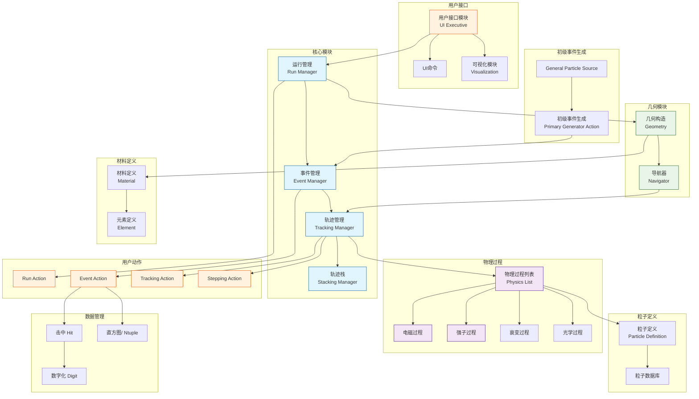

# 核物理实验以及蒙卡在核物理中的应用

# Geant4模拟

## 目录结构

```mermaid
graph TB
    subgraph "用户接口"
        UI[用户接口模块<br/>UI Executive]
        UI --> UI_Commander[UI命令]
        UI --> Visual[可视化模块<br/>Visualization]
    end

    subgraph "核心模块"
        Run[运行管理<br/>Run Manager]
        Event[事件管理<br/>Event Manager]
        Tracking[轨迹管理<br/>Tracking Manager]
        Stack[轨迹栈<br/>Stacking Manager]
    end

    subgraph "几何模块"
        Geo[几何构造<br/>Geometry]
        Navig[导航器<br/>Navigator]
    end

    subgraph "物理过程"
        Processes[物理过程列表<br/>Physics List]
        Processes --> Electromagnetic[电磁过程]
        Processes --> Hadronic[强子过程]
        Processes --> Decay[衰变过程]
        Processes --> Optical[光学过程]
    end

    subgraph "粒子定义"
        Particle[粒子定义<br/>Particle Definition]
        ParticleDB[粒子数据库]
    end

    subgraph "初级事件生成"
        PrimGen[初级事件生成<br/>Primary Generator Action]
        GPS[General Particle Source]
    end

    subgraph "用户动作"
        RunAction[Run Action]
        EventAction[Event Action]
        TrackingAction[Tracking Action]
        SteppingAction[Stepping Action]
    end

    subgraph "数据管理"
        Hit[击中 Hit]
        Digit[数字化 Digit]
        Ntuple[直方图/ Ntuple]
    end

    subgraph "材料定义"
        Material[材料定义<br/>Material]
        Element[元素定义<br/>Element]
    end

    %% 连接关系
    UI --> Run
    Run --> Event
    Event --> Tracking
    Tracking --> Stack

    Run --> Geo
    Geo --> Navig
    Geo --> Material
    Material --> Element

    Processes --> Particle
    Particle --> ParticleDB

    PrimGen --> Event
    GPS --> PrimGen

    Run --> RunAction
    Event --> EventAction
    Tracking --> TrackingAction
    Tracking --> SteppingAction

    EventAction --> Hit
    Hit --> Digit
    EventAction --> Ntuple

    %% 关键流程
    Tracking --> Processes
    Navig --> Tracking

    %% 样式
    classDef core fill:#e1f5fe,stroke:#01579b
    classDef physics fill:#f3e5f5,stroke:#4a148c
    classDef geometry fill:#e8f5e8,stroke:#1b5e20
    classDef user fill:#fff3e0,stroke:#e65100

    class Run,Event,Tracking,Stack core
    class Processes,Electromagnetic,Hadronic physics
    class Geo,Navig geometry
    class RunAction,EventAction,TrackingAction,SteppingAction,UI user
```
