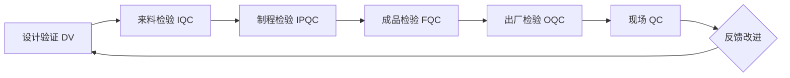

# 质量控制 · Quality Control

> 质量控制（Quality Control, QC）是通过操作技术和管理活动，维持产品品质符合规定要求的系统性方法。对 CT 探测器而言，QC 贯穿设计、来料、生产、出厂到现场服务的全生命周期。

---

## 1. 质量控制体系概览

### 1.1 QC 与 QA 的区别

| 维度 | 质量控制（QC）| 质量保证（QA）|
|------|--------------|--------------|
| 关注点 | 产品本身（结果）| 过程/体系（原因）|
| 方法 | 检验、测试、测量 | 流程设计、审核、标准化 |
| 时机 | 事后/过程中 | 全过程预防 |
| 输出 | 合格/不合格判定 | 体系合规证明 |
| 工具 | 控制图、校准、GR&R | SOP、审计、FMEA |

### 1.2 CT 探测器 QC 全流程



---

## 2. 各阶段质量控制

### 2.1 设计验证（DV）

| 验证项目 | 方法 | 判定标准 |
|---------|------|---------|
| 功能性能 | 实验室基准测试 | 满足规格书要求 |
| 环境适应性 | 温湿度、振动、冲击试验 | IEC 60068 系列 |
| 电磁兼容 | EMI/EMC 测试 | YY 0505 / IEC 60601-1-2 |
| 安全 | 电气安全测试 | IEC 60601-1 |
| 可靠性 | 加速寿命试验 | MTBF 达标 |

### 2.2 来料检验（IQC）

| 物料类别 | 检验项目 | 工具/方法 |
|---------|---------|----------|
| 闪烁体 | 发光效率、衰减时间、均匀性 | 积分球、示波器 |
| ASIC | 功能测试、直流参数 | 探针台、ATE |
| PCB | 通断、阻抗、外观 | 飞针测试、AOI |
| 机械件 | 尺寸、形位公差 | CMM、影像测量仪 |
| 连接器 | 插拔力、接触电阻 | 拉力机、微欧计 |

### 2.3 制程检验（IPQC）

- **首件检验**（First Article Inspection）：每班次/换线后首件全检
- **巡检**（Patrol Inspection）：每小时抽检关键参数
- **关键工序控制点**：
  - 凸点焊接：X-ray 透视检查虚焊/桥接
  - 固晶：Die Shear 测试（> 界面强度标准）
  - 引线键合：拉力/剪切力测试
  - 封装：气密性测试（He Leak Test）

### 2.4 成品检验（FQC / OQC）

| 检验项目 | 方法 | 抽样方案 |
|---------|------|---------|
| 像素坏点数 | 暗场/亮场图像分析 | 100% 全检 |
| 增益均匀性 | Flood Field 图像 | AQL 0.65 |
| 噪声水平 | 暗场标准差 | 100% 全检 |
| 能量分辨率 | 放射源能谱测试 | AQL 1.0 |
| 外观 | 目视/AOI | AQL 0.4 |

---

## 3. 统计过程控制（SPC）

### 3.1 控制图类型

| 数据类型 | 控制图 | 适用场景 |
|---------|-------|---------|
| 计量值（连续）| X-bar & R 图 | 关键尺寸、增益值 |
| 计量值（连续）| X-bar & S 图 | 样本量 > 10 |
| 计数值（不合格品）| p 图 / np 图 | 良率跟踪 |
| 计数值（缺陷数）| c 图 / u 图 | 焊点缺陷、坏像素数 |

### 3.2 过程能力分析

| 指标 | 定义 | 合格标准（CT 探测器）|
|------|------|---------------------|
| Cp | 过程潜力（无偏移）| ≥ 1.33 |
| Cpk | 过程能力（考虑偏移）| ≥ 1.33（关键特性 ≥ 1.67）|
| Pp / Ppk | 长期过程性能 | Ppk ≥ 1.67 |

```
Cp  = (USL - LSL) / (6σ)
Cpk = min[(μ - LSL)/(3σ), (USL - μ)/(3σ)]
```

---

## 4. 测量系统分析（MSA）

> 参见 [GR&R 详述](grr.md)

MSA 核心问题：**测量数据的变异有多少来自测量系统本身？**

| 分析项目 | 目标 | 判定准则 |
|---------|------|---------|
| 重复性（Repeatability）| 同一人同一设备重复测量变异 | GR&R% < 10% 可接受 |
| 再现性（Reproducibility）| 不同人/不同设备间变异 | GR&R% < 30% 需改进 |
| 偏倚（Bias）| 测量均值与真值之差 | 偏差不显著（t 检验）|
| 线性（Linearity）| 偏倚随测量值的变化 | 斜率不显著 |
| 稳定性（Stability）| 随时间测量值漂移 | 控制图判异准则 |

---

## 5. 质量工具箱

| 工具 | 用途 | CT 探测器应用举例 |
|------|------|------------------|
| 检查表 | 数据收集 | 每日校准记录表 |
| 柏拉图 | 找出关键少数 | 失效模式分布分析 |
| 因果图（鱼骨图）| 根因分析 | 坏点率升高根因分析 |
| 直方图 | 分布形态观察 | 增益分布正态性检验 |
| 散点图 | 相关性分析 | 温度 vs 增益漂移 |
| 控制图 | 过程监控 | 关键尺寸 SPC 监控 |
| 层别法 | 分层比较 | 不同批次/产线对比 |

---

## 6. 参考标准

- **ISO 9001**：质量管理体系
- **IATF 16949**：汽车行业 QC（适用于汽车零部件 CT）
- **ISO 13485**：医疗器械质量管理体系
- **AIAG MSA**：测量系统分析手册
- **AIAG SPC**：统计过程控制手册
- **IEC 61223-3-5**：CT 图像质量检验
- **YY/T 0310**：X 射线计算机体层摄影设备
