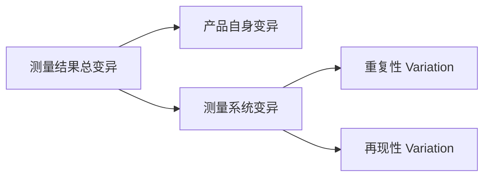
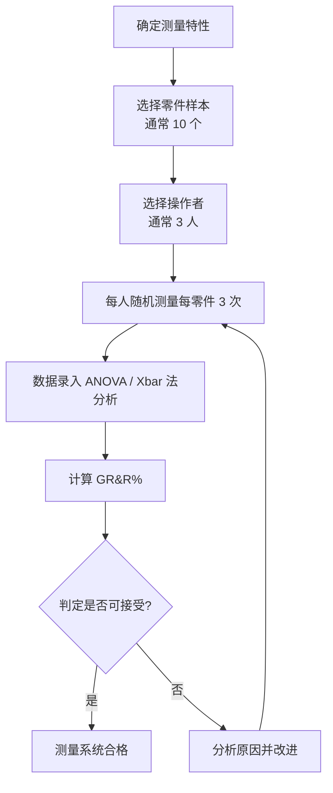
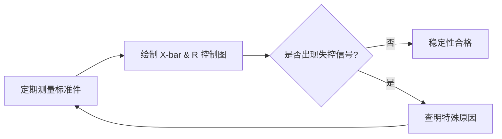

# 测量系统分析 · MSA & GR&R

> 测量系统分析（Measurement System Analysis, MSA）用于评估测量系统的准确性、精确性和稳定性。**GR&R（Gage Repeatability and Reproducibility，量具重复性与再现性）** 是 MSA 中最核心的分析方法。

---

## 1. 测量系统基本术语



| 术语 | 英文 | 定义 |
|------|------|------|
| 重复性 | Repeatability | 同一操作者、同一量具、同一零件反复测量的变异 |
| 再现性 | Reproducibility | 不同操作者之间测量结果的变异 |
| 偏倚 | Bias | 测量平均值与参考值（真值）之差 |
| 线性 | Linearity | 偏倚在操作范围内的变化 |
| 稳定性 | Stability | 测量系统随时间保持精度的能力 |
| 分辨率 | Resolution | 量具能够识别的最小测量变化 |

---

## 2. GR&R 研究流程

### 2.1 实施步骤



### 2.2 样本选择原则

| 原则 | 说明 |
|------|------|
| 代表过程变异 | 样本应覆盖过程的总变异范围（从 LSL 到 USL）|
| 随机编号 | 零件编号打乱，操作者不知道编号含义 |
| 随机测量顺序 | 每次测量顺序随机，避免系统偏差 |
| 正常测量条件 | 使用日常测量环境、方法和操作者 |

---

## 3. 数据分析方法

### 3.1 均值极差法（Xbar & R 法）

适用于：**2~3 名操作者、5~10 个零件、2~3 次重复**

**计算步骤：**

1. **计算极差 R**
   - 每个操作者对每个零件的 3 次测量极差 R_ij
   - 平均极差：`R̄ = ΣR_ij / (操作者数 × 零件数)`

2. **计算重复性（设备变异 EV）**
   ```
   EV = R̄ × K1
   ```
   | 测量次数 m | K1 值 |
   |-----------|--------|
   | 2 | 0.8862 |
   | 3 | 0.5908 |

3. **计算再现性（评价人变异 AV）**
   ```
   AV = √[(X̄_diff × K2)² - (EV² / (n × r))]
   ```
   | 操作者数 a | K2 值 |
   |-----------|--------|
   | 2 | 0.7071 |
   | 3 | 0.5231 |

   - n = 零件数，r = 重复次数
   - X̄_diff = 操作者平均测量值的最大差值

4. **计算 GR&R**
   ```
   GR&R = √(EV² + AV²)
   ```

5. **计算零件变异 PV**
   ```
   PV = R̃_p × K3
   ```
   | 零件数 n | K3 值 |
   |-----------|--------|
   | 5 | 0.4299 |
   | 10 | 0.3105 |

6. **计算总变异 TV**
   ```
   TV = √(GR&R² + PV²)
   ```

7. **计算 GR&R%**
   ```
   %GR&R = (GR&R / TV) × 100%
   %EV = (EV / TV) × 100%
   %AV = (AV / TV) × 100%
   %PV = (PV / TV) × 100%
   ```

### 3.2 ANOVA 法（方差分析法）

> **推荐方法**：比 Xbar&R 法更精确，能分离交互效应

- 使用统计软件（Minitab、JMP、R）进行方差分析
- 可分析操作者 × 零件的交互作用
- 适用于任何样本数/测量次数组合

---

## 4. 判定标准（AIAG MSA 手册）

| GR&R% 范围 | 判定 | 措施 |
|-------------|------|------|
| **< 10%** | ✅ 可接受 | 测量系统合格，正常使用 |
| **10% ~ 30%** | ⚠️ 条件可接受 | 根据应用重要性、量具成本、维修成本综合判定 |
| **> 30%** | ❌ 不可接受 | 必须改进测量系统 |

### 4.1 分级判定（更严格的医疗/航空标准）

| 指标 | 可接受 | 需改进 | 不可接受 |
|------|--------|--------|---------|
| %GR&R | < 10% | 10%~20% | > 20% |
| ndc（区别分类数）| ≥ 5 | 3~4 | < 3 |
| %EV（重复性）| < 7% | 7%~15% | > 15% |
| %AV（再现性）| < 7% | 7%~15% | > 15% |

> **ndc = 1.41(PV/GR&R)**，ndc ≥ 5 表示测量系统能充分区分零件间的变异

---

## 5. CT 探测器测量系统应用

### 5.1 适用测量特性

| 测量特性 | 测量设备 | GR&R 研究重点 |
|---------|---------|----------------|
| 像素增益 | 放射源 + 读出系统 | 重复测量中的读出噪声 |
| 像素偏移（Offset）| 暗场图像分析 | 温度稳定性影响 |
| 坏像素检测 | 自动测试软件 | 判定标准一致性 |
| 探测效率 DQE | X-ray 源 + 模体 | 剂量稳定性 |
| 空间分辨率 MTF | 线对卡扫描 | 重建算法参数一致性 |
| 机械安装精度 | 激光跟踪仪 | 操作者操作差异 |

### 5.2 CT 增益 GR&R 研究示例

**研究设计：**
- 操作者：3 人（A/B/C）
- 探测器模块：10 个（覆盖良品~边缘良品）
- 重复次数：每人每模块测量 3 次
- 测量值：各像素平均增益（DN/keV）

**判定：**
- 若 %GR&R > 20% → 检查：温度变化、读出噪声、放射源稳定性
- 若 %AV 偏高 → 操作者培训、标准化操作步骤（SOP）
- 若 %EV 偏高 → 改进量具（更稳定的高压、温控环境）

---

## 6. 偏倚（Bias）分析

### 6.1 偏倚检验步骤

1. 选取一个标准件（已知参考值）
2. 同一操作者测量 15~50 次
3. 计算平均值与参考值之差 → **偏倚**
4. **t 检验**：判断偏倚是否统计显著

```
t = |偏倚| / (σ / √n)
若 t < t临界值 → 偏倚不显著，量具可接受
```

### 6.2 偏倚接受准则

| 偏倚 | 判定 |
|------|------|
| 统计不显著（p > 0.05）| ✅ 偏倚可接受 |
| 统计显著但 |偏倚| < 规格公差的 5% | ⚠️ 条件接受 |
| |偏倚| > 规格公差的 5% | ❌ 需要校准 |

---

## 7. 线性（Linearity）分析

> 线性 = 在整个操作范围内，偏倚的变化程度

### 7.1 线性研究步骤

1. 选取 **5 个以上**覆盖量程的基准件
2. 每个基准件测量 **10~12 次**
3. 计算每个基准件的偏倚
4. 线性回归：偏倚 = a + b × 参考值
5. 判断：**斜率 b 是否显著不为 0**（t 检验）
   - 若 b 不显著 → 线性良好
   - 若 b 显著 → 存在线性问题，需要校准

---

## 8. 稳定性（Stability）分析

### 8.1 控制图法



**评价周期：** 每天/每周测量一次标准件，连续 25 组数据

**失控判异准则（Western Electric Rules）：**
- 1 个点超出 3σ 控制限
- 连续 9 个点在中心线同一侧
- 连续 6 个点递增/递减
- 连续 14 个点交替上下

---

## 9. GR&R 改善措施

| 问题 | 可能原因 | 改善措施 |
|------|---------|---------|
| 重复性 EV 过大 | 量具精度不足 | 升级测量设备、提高分辨率 |
| 重复性 EV 过大 | 环境干扰（温度/振动）| 增加环境控制、减震台 |
| 再现性 AV 过大 | 操作手法不一致 | 制定 SOP、操作培训 |
| 再现性 AV 过大 | 量具设定不同 | 统一夹具、固定测量参数 |
| 偏倚显著 | 量具未校准 | 定期校准、建立校准周期 |
| 线性不良 | 量具在量程两端精度差 | 分段校准、更换量具 |
| 稳定性差 | 量具漂移 | 缩短校准周期、增加检查频率 |

---

## 10. CT 行业 MSA 应用清单

| 过程 | 测量特性 | 研究频率 | 接受标准 |
|------|---------|---------|---------|
| 来料检验 | 闪烁体发光效率 | 每供应商/每批次 | %GR&R < 20% |
| 制程检验 | 固晶贴装精度 | 每设备/每月 | %GR&R < 30% |
| 成品检验 | 像素坏点数 | 每班次/每周 | ndc ≥ 5 |
| 校准过程 | CT 值精度 | 每台设备/每日 | 偏倚 < 5 HU |
| 现场维护 | 空间分辨率 | 每站点/每季度 | %GR&R < 15% |

---

## 11. 参考标准

- **AIAG MSA 4th Edition**：测量系统分析手册（汽车行业权威标准）
- **ISO 22514-7**：统计方法——过程能力与性能（MSA 部分）
- **ASTM E177**：测量不确定度术语与表达式
- **ISO/IEC 17025**：检测和校准实验室能力认可准则（要求 MSA）
- **YY/T 0316**：医疗器械风险管理（要求测量不确定性评估）
- **JCGM 100:2008（GUM）**：测量不确定度表示指南
