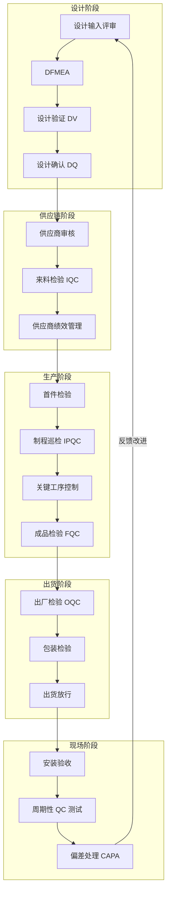
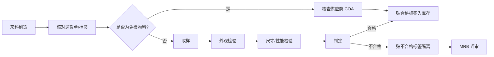
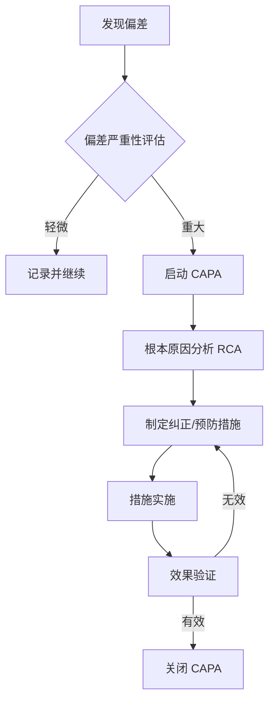

# 质量控制过程 · QC Process

> 系统化的质量控制过程是确保 CT 探测器从设计到交付全生命周期品质稳定的核心。本文档详细描述各阶段的质量控制流程。

---

## 1. 质量控制过程全景

---

## 2. 设计阶段质量控制

### 2.1 设计评审（Design Review）

| 评审节点 | 参与角色 | 评审重点 |
|---------|---------|---------|
| 概念设计评审 | 系统/机械/电子/算法 | 需求完整性、技术方案可行性 |
| 初步设计评审 | 全体设计团队 + 质量 | 架构设计、DFMEA 初版 |
| 详细设计评审 | 设计 + 工艺 + 质量 | 可制造性、可测试性 |
| 设计验证评审 | 设计 + 质量 + 法规 | DV 结果、遗留问题关闭 |

### 2.2 DFMEA（设计失效模式及影响分析）

| 步骤 | 内容 | 输出 |
|------|------|------|
| 功能分析 | 明确每个模块的功能要求 | 功能树 |
| 失效模式识别 | 列举可能的失效方式 | 失效模式清单 |
| 风险评分 | S（严重度）× O（频度）× D（探测度）| RPN 值 |
| 改进措施 | 针对高 RPN 项制定措施 | 改进计划 |
| 跟踪验证 | 措施执行后的 RPN 重评 | RPN 降低证明 |

**CT 探测器 DFMEA 关键项示例：**

| 功能 | 失效模式 | S | O | D | RPN | 改进措施 |
|------|---------|---|---|---|-----|---------|
| 射线探测 | 像素死区 | 8 | 4 | 3 | 96 | 增加冗余像素设计 |
| 信号读出 | ASIC 过热失效 | 7 | 3 | 4 | 84 | 优化散热设计，增加温度监控 |

---

## 3. 来料质量控制（IQC）

### 3.1 抽样方案（基于 MIL-STD-105E / ISO 2859）

| AQL 等级 | 适用物料 | 抽样严格度 |
|---------|---------|-----------|
| AQL 0.1 | 关键件（ASIC、闪烁体）| 加严 |
| AQL 0.65 | 重要件（PCB、接插件）| 正常 |
| AQL 1.0 | 一般件（结构件、辅料）| 放宽 |
| AQL 2.5 | 包装材料 | 放宽 |

### 3.2 IQC 检验流程

### 3.3 关键物料检验项目

**闪烁体（CZT/CsI）**

| 检验项目 | 方法 | 设备 | 判定标准 |
|---------|------|------|---------|
| 发光效率 | 相对强度测量 | 积分球 + 光度计 | ≥ 规格下限 |
| 衰减时间 | 单光子计数 | 示波器 + TCSPC | 符合 datasheet |
| 均匀性 | 面扫描 | 显微成像系统 | 变异系数 < 5% |
| 外观缺陷 | 目视 + 显微镜 | AOI | 无裂纹、无污染 |

**ASIC 读出芯片**

| 检验项目 | 方法 | 设备 | 判定标准 |
|---------|------|------|---------|
| 功能测试 | 晶圆测试 / 成品测试 | ATE 测试机 | 全功能通过 |
| 直流参数 | IV 曲线扫描 | 半导体参数分析仪 | 符合规格 |
| 增益一致性 | 多通道并行测试 | 定制测试板 | 通道间差异 < 3% |

---

## 4. 制程质量控制（IPQC）

### 4.1 关键工序控制计划

| 工序 | 控制特性 | 测量方法 | 频率 | 记录方式 |
|------|---------|---------|------|---------|
| 固晶（Die Attach）| 贴装精度、胶层厚度 | AOI + 显微镜 | 首件 + 每 2h 抽检 | SPC 记录表 |
| 引线键合（Wire Bond）| 拉力、焊点形貌 | 拉力测试仪 + AOI | 每批次首件 + 巡检 | 拉力记录表 |
| 凸点焊接（Bump）| X-ray 透视 | X-ray 检测机 | 100% 全检 | X-ray 图像存档 |
| 气密性封装 | 氦气泄漏率 | He Leak Detector | 100% 全检 | 记录仪自动记录 |
| PCBA | 焊点质量、元件极性 | AOI + ICT | 100% AOI | AOI 报告 |
| 模块组装 | 对准精度、扭矩 | 影像测量 + 扭矩扳手 | 首件 + 巡检 | 组装记录表 |

### 4.2 首件检验（FAI）流程

1. 生产过程中每班次 / 换线 / 设备维修后，生产第一件产品
2. 操作员自检 → IPQC 全尺寸检验 → 填写《首件检验记录表》
3. 首件合格后方可继续生产
4. 首件样品留存至该批次结束

---

## 5. 成品质量控制（FQC / OQC）

### 5.1 FQC 检验项目（CT 探测器模块）

| 类别 | 检验项目 | 方法 | 判定标准 |
|------|---------|------|---------|
| 图像性能 | 坏像素数 | 暗场 + 亮场图像分析 | < 0.1% 总像素 |
| 图像性能 | 增益均匀性 | Flood Field 分析 | σ/μ < 3% |
| 图像性能 | 噪声（Readout Noise）| 暗场标准差 | < 特定 e⁻ RMS |
| 图像性能 | MTF | 边缘扩散函数分析 | 符合规格 |
| 图像性能 | DQE | 噪声功率谱分析 | 符合规格 |
| 电气性能 | 功耗 | 电源电流测量 | ≤ 设计规格 |
| 电气性能 | 通信误码率 | BER 测试 | < 10⁻¹² |
| 环境 | 高低温工作 | 温箱测试 | 全功能正常 |

### 5.2 OQC 出货检验

- **检验方式**：按 AQL 抽样，关键项 100% 全检
- **出货报告**：每台设备附带 COC（Certificate of Compliance）
- **放行权限**：质量经理最终批准出货放行

---

## 6. 现场质量控制

### 6.1 安装验收（Site Acceptance Test, SAT）

| 测试项目 | 方法 | 标准 |
|---------|------|------|
| 安装精度 | 激光跟踪仪 | 符合安装图纸 |
| 安全联锁 | 功能测试 | 全部联锁有效 |
| 图像性能 | 模体扫描 | 达到技术规格 |
| 辐射安全 | 泄漏剂量测量 | 符合 GB 18871 |

### 6.2 周期性 QC 测试

| 频率 | 测试项目 | 方法 |
|------|---------|------|
| 每日 | 暗场/亮场校准 | 自动校准程序 |
| 每周 | 水模 CT 值精度 | 扫描水模 |
| 每月 | 均匀性、噪声 | 水模扫描分析 |
| 每季度 | MTF、DQE | 专业模体测试 |
| 每年 | 全面性能检测 | 按 IEC 61223 执行 |

### 6.3 偏差处理与 CAPA

**CAPA 关键要素：**
- **根本原因工具**：5-Why、鱼骨图、Is/Is Not 分析
- **措施跟踪**：指定责任人、完成期限、验证标准
- **闭环证明**：措施实施证据 + 效果数据

---

## 7. 质量记录管理

| 记录类型 | 保存期限 | 存储介质 |
|---------|---------|---------|
| 设计评审记录 | 产品生命周期 + 5 年 | 电子文档管理系统 |
| DFMEA/PFMEA | 产品生命周期 + 5 年 | 电子文档管理系统 |
| IQC 检验报告 | 3 年 | 纸质 + 电子扫描 |
| 生产过程记录 | 批记录保存至保质期后 1 年 | 纸质 + 电子 |
| FQC/OQC 报告 | 产品生命周期 + 5 年 | 电子文档管理系统 |
| CAPA 记录 | 措施关闭后 5 年 | 质量管理系统 |

---

## 8. 参考标准与规范

- **ISO 9001**：质量管理体系——要求
- **ISO 13485**：医疗器械——质量管理体系
- **IEC 61223-3-5**：CT 图像质量恒定试验
- **MIL-STD-105E**：抽样检验程序
- **AIAG APQP**：产品质量先期策划
- **AIAG PPAP**：生产件批准程序
- **YY/T 0287**：医疗器械质量管理体系
