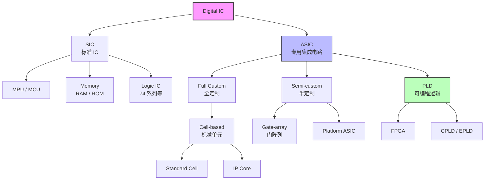
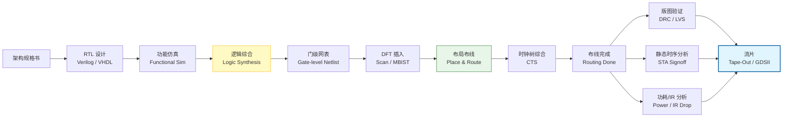
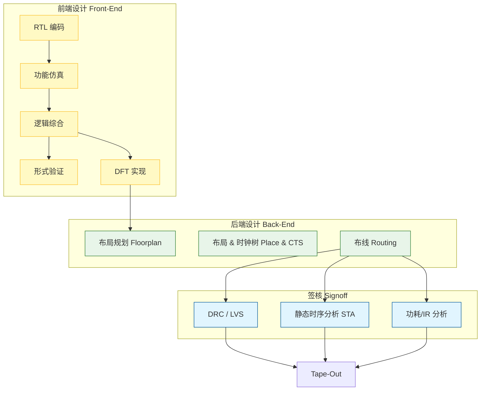

# VLSI ASIC 设计流程与基础

## 一、 ASIC 基础概念

**ASIC (Application-Specific Integrated Circuit)**

- **定义**：专用集成电路，为特定应用场景定制的芯片。
- **特点**：性能高、功耗低、面积小、成本高（一次性工程费用高）、不可更改。
- **对比**：
  - **SIC (标准IC)**：通用性强，如MPU、MCU、Memory。
  - **PLD (可编程逻辑)**：灵活性高，如FPGA，适合快速原型验证。

---

## 二、 设计流程总览

VLSI设计是一个从“抽象逻辑”到“物理实体”的转化过程，主要分为三个阶段：

1.  **前端设计 (Front-End)**：逻辑与功能实现（RTL -> Netlist）。
2.  **逻辑综合 (Logic Synthesis)**：算法与约束驱动（Netlist生成）。
3.  **后端设计 (Back-End)**：物理实现与验证（Netlist -> Layout）。

---

## 三、 详细设计流程

### 1. 前端设计 (Front-End Design)

**核心目标**：实现正确的功能逻辑。

- **输入**：
  - 芯片架构规格书 (Architecture Spec)
  - 性能指标：速度 (Frequency)、功耗 (Power)
  - 设计约束：时序约束 (SDC)、低功耗约束 (UPF)
- **核心步骤**：
  1.  **RTL 编码 (RTL Coding)**：使用 Verilog/VHDL 描述硬件行为。
  2.  **功能验证 (Functional Verification)**：通过仿真确保代码逻辑符合规格（参考模型 Ref Model）。
  3.  **逻辑综合 (Logic Synthesis)**：
      - 工具：Synopsys Design Compiler (DC)
      - 过程：将 RTL 转化为由标准单元组成的门级网表 (Netlist)。
  4.  **DFT 实现 (Design for Test)**：插入扫描链 (Scan-chain) 或 MBIST，便于芯片量产测试。
- **验证手段**：
  - **形式验证 (Formal Verification)**：数学证明综合前后功能等价。
  - **门级仿真 (Gate Simulation)**：验证网表功能。

### 2. 中端衔接：静态时序分析 (STA)

**核心目标**：确保电路在预定频率下稳定工作。

- **预布局 STA (Pre-layout STA)**：综合后，基于线负载模型预估时序。
- **综合时序报告 (Synthesis Report)**：检查建立时间 (Setup Time) 和保持时间 (Hold Time)。

### 3. 后端设计 (Back-End Design)

**核心目标**：将门级网表转化为物理版图，并通过物理验证。

- **核心步骤**：
  1.  **自动布局布线 (Auto Place & Route, APR)**：
      - 工具：Synopsys ICC / Cadence Innovus
      - 过程：放置标准单元 -> 时钟树综合 (CTS) -> 布线 (Routing)。
  2.  **低功耗实现 (Low Power Flow)**：优化电源网络，降低动态/静态功耗。
- **物理验证 (Physical Verification)**：
  - **DRC (Design Rule Check)**：检查版图是否符合晶圆厂制造规则。
  - **LVS (Layout vs Schematic)**：比对版图与网表的逻辑一致性。
  - **Antenna Check**：检查天线效应。
- **签核分析 (Signoff)**：
  - **静态时序分析 (Post-layout STA)**：考虑实际寄生参数后的最终时序确认 (Timing Signoff)。
  - **功耗/IR 分析 (Power/IR Signoff)**：分析电源网络的压降 (IR Drop) 和电迁移 (EM)，确保供电稳定。
- **最终输出**：
  - **GDSII 文件**：版图数据。
  - **流片 (Tape-Out)**：交付晶圆厂制造。

---

## 四、 关键设计约束 (Constraints)

在整个流程中，设计师需密切关注以下约束：

1.  **时序约束 (Timing Constraints)**：决定芯片的最高运行频率。
2.  **功耗约束 (Power Constraints)**：限制芯片的能量消耗。
3.  **面积约束 (Area Constraints)**：控制芯片成本（Die Size）。
