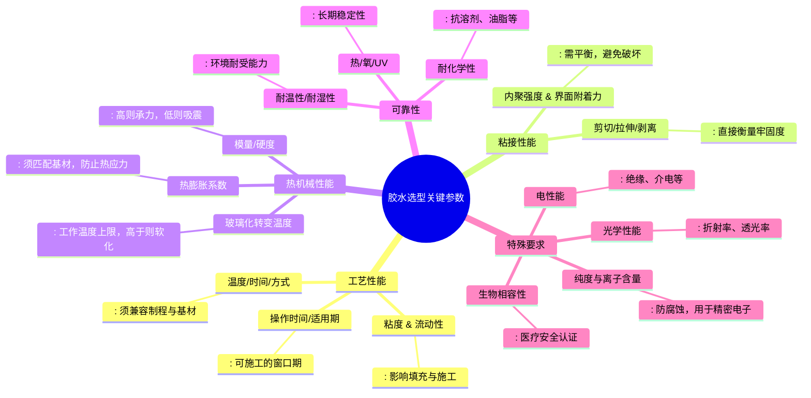

# 系统
## 胶水选择

经过温湿、冷热冲击和机械冲击后，电性能和粘接性能稳定。底部填充胶的热膨胀系数（CTE）、玻璃化转变温度（Tg）以及模量系数（Modulus）等，要与 PCB 基材、器件的芯片和焊料合金等因素进行匹配，胶粘剂的 Tg 对 CTE 有着重要的影响。当温度低于 Tg 时，CTE 较小，反之则 CTE 急剧增加。
- 玻璃转变温度（Tg）：
    - 胶体从“玻璃态”变为“高弹态”的临界温度。工作温度必须低于Tg，否则胶体软化，强度和模量骤降，失去保护作用。
    - Tg在材料高CTE的情况下对热循环疲劳寿命没有明显的影响，但在CTE比较小的情况下对疲劳寿命则有一定影响，因为材料在Tg点以下温度和Tg点以上温度，CTE变化差异很大。实验表明，在低CTE情况下，Tg越高热循环疲劳寿命越长。
- 热膨胀系数 (CTE)
    - 胶体受热膨胀的程度。必须与所粘接的材料（如硅芯片、陶瓷、PCB）匹配，否则温度变化会产生应力，导致开裂或脱粘。
    - 热膨胀系数具体是指当温度每升高 1℃时，单位长度材料的相对伸长量。它反映了材料受热后的膨胀或收缩特性。在电子封装中，如果不同材料的热膨胀系数差异较大，当温度变化时，会在材料界面处产生应力，可能导致封装开裂、焊点失效等问题，从而影响产品的可靠性和使用寿命。
- 模量/硬度
    - 反映胶体抵抗变形的能力。高模量（硬胶）承力好，低模量（软胶）更能吸收应力、缓冲震动。

- ​剪切/拉伸/剥离强度
    - 
