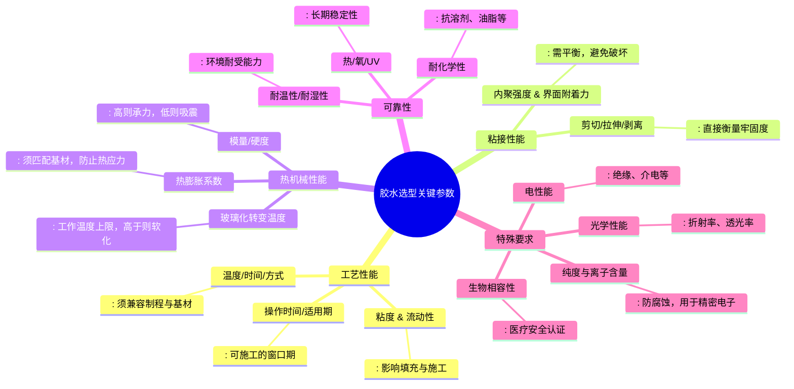

# 系统

```mermaid

mindmap
root((胶水选型关键参数))
  工艺性能
    温度/时间/方式
      : 须兼容制程与基材
    粘度 & 流动性
      : 影响填充与施工
    操作时间/适用期
      : 可施工的窗口期
  粘接性能
    剪切/拉伸/剥离
      : 直接衡量牢固度
    内聚强度 & 界面附着力
      : 需平衡，避免破坏
  热机械性能
    玻璃化转变温度
      : 工作温度上限，高于则软化
    模量/硬度
      : 高则承力，低则吸震
    热膨胀系数
      : 须匹配基材，防止热应力
  可靠性
    耐温性/耐湿性
      : 环境耐受能力
    热/氧/UV
      : 长期稳定性
    耐化学性
      : 抗溶剂、油脂等
  特殊要求
    电性能
      : 绝缘、介电等
    光学性能
      : 折射率、透光率
    纯度与离子含量
      : 防腐蚀，用于精密电子
    生物相容性
      : 医疗安全认证

```

