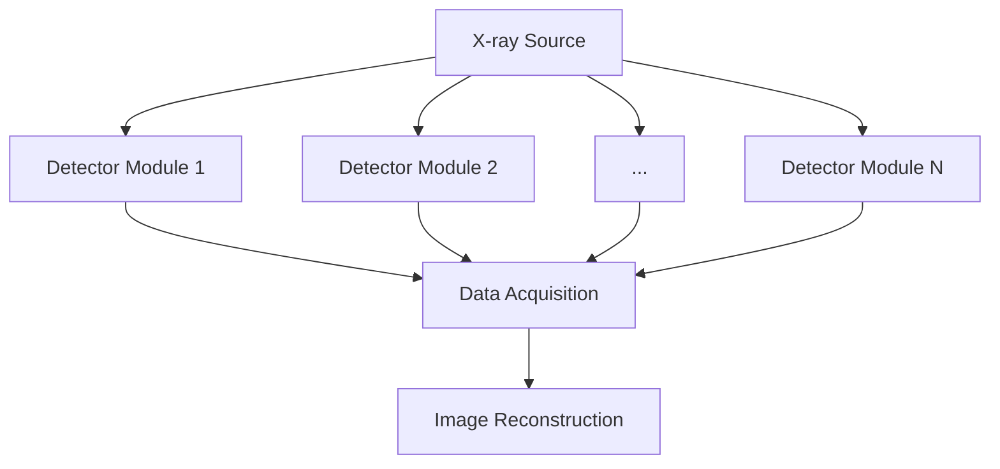

# 可靠性分析 · Reliability Analysis

> 可靠性（Reliability）是指产品在规定条件下、规定时间内完成规定功能的能力。对 CT 探测器系统而言，可靠性直接决定设备的临床可用性和维护成本。

---

## 1. 可靠性基本概念

| 术语 | 英文 | 定义 |
|------|------|------|
| 可靠度 | Reliability | 产品在时间 t 内正常工作的概率 R(t) |
| 失效率 | Failure Rate λ(t) | 单位时间内失效的概率 |
| MTBF | Mean Time Between Failures | 平均故障间隔时间 |
| MTTF | Mean Time To Failure | 平均失效前时间（不可维修产品）|
| MTTR | Mean Time To Repair | 平均修复时间 |
| 可用性 | Availability | A = MTBF / (MTBF + MTTR) |

### 1.1 浴盆曲线（Bathtub Curve）


| 阶段 | 特征 | 应对措施 |
|------|------|---------|
| 早期失效期 | 失效率高，随时间下降 | 老练筛选（Burn-in）、环境应力筛选（ESS）|
| 偶然失效期 | 失效率稳定、随机 | 可靠性预计、预防性维护 |
| 耗损失效期 | 失效率上升 | 寿命预测、定期更换 |

---

## 2. CT 探测器可靠性关键失效模式

### 2.1 主要失效模式（FMEA 框架）

| 失效模式 | 可能原因 | 影响 | 检测手段 |
|---------|---------|------|---------|
| 像素坏点/坏行 | ASIC 通道失效、凸点虚焊 | 图像伪影、坏道 | 暗场/亮场校准、Defect Map |
| 增益漂移 | 温度漂移、ASIC 老化 | CT 值不准、伪影 | 每日校准、Air Calibration |
| 闪烁体退化 | 湿度侵入、Cerenkov 辐射损伤 | 探测效率下降 | DQE 测试、长期跟踪 |
| 高压击穿 | 封装缺陷、污染 | 通道失效、电弧 | HiPot 测试、Partial Discharge |
| 热失控 | 散热设计不足、风道堵塞 | 读数漂移、系统宕机 | 热成像、温度监控 |
| 连接器接触不良 | 振动、热循环导致微动磨损 | 间歇性通信故障 | 连续性测试、振动测试 |

### 2.2 应力类型与加速模型

| 应力类型 | 加速模型 | 公式 |
|---------|---------|------|
| 温度（热电应力）| Arrhenius 模型 | AF = exp[Ea/k × (1/Tuse - 1/Tstress)] |
| 电压（电应力）| Eyring 模型 | AF = (Vstress/Vuse)^n |
| 温湿度（腐蚀）| Peck 模型 | AF = (RHstress/RHuse)^n × exp(Ea/k × ΔT) |
| 温度循环 | Coffin-Manson | AF = (ΔTstress/ΔTuse)^n |

- **Ea**：激活能（eV），半导体典型值 0.3~1.0 eV
- **k**：玻尔兹曼常数 8.617×10⁻⁵ eV/K
- **n**：经验指数，典型 2~3

---

## 3. 可靠性预计方法

### 3.1 常用标准

| 标准 | 适用范围 | 说明 |
|------|---------|------|
| MIL-HDBK-217F | 军用电子 | 最保守，零件计数法/应力分析法 |
| Telcordia SR-332 | 通信电子 | 基于现场数据，较实际 |
| IEC 62380 | 通用电子 | 国际电工委员会标准 |
| SN 29500 | 工业电子 | Siemens 标准，工业场景适用 |
| FIDES | 航空航天 | 考虑使用剖面，较精细 |

### 3.2 CT 探测器可靠性框图（RBD）



- **串联模型**：任一模块失效 → 系统失效，R_system = ∏ R_i
- **并联冗余**：K/N 表决系统，提高关键通道可靠性
- **备用冗余**：冷备/热备，MTBF 显著提升

---

## 4. 可靠性试验

### 4.1 环境应力筛查（ESS）

| 应力 | 条件 | 目的 |
|------|------|------|
| 温度循环 | -40°C ↔ +85°C，5 cycles | 激发焊接/封装缺陷 |
| 随机振动 | 5~500 Hz，0.04 g²/Hz | 激发结构/连接缺陷 |
| 高温老练 | 85°C，通电 168h | 激发早期失效 |
| 温度湿度偏置 | 85°C/85%RH，1000h | 激发腐蚀/迁移缺陷 |

### 4.2 寿命试验与加速因子

```
AF(温度) = exp[(Ea/k) × (1/T_use - 1/T_stress)]

例：Ea=0.7 eV，T_use=323K（50°C），T_stress=398K（125°C）
AF = exp[(0.7/8.617e-5) × (1/323 - 1/398)] ≈ 156

即：125°C 下 1000h ≈ 50°C 下 15.6 万小时（约 18 年）
```

### 4.3 可靠性增长试验（RGT）

通过 HALT（高加速寿命试验）发现设计弱点 → 改进 → 验证，循环提升可靠性。

---

## 5. 维修性分析

### 5.1 关键指标

| 指标 | 公式 | CT 系统典型值 |
|------|------|--------------|
| MTTR | ∑(修复时间)/修复次数 | 目标 < 2h（现场）/ < 4h（返厂）|
| 可用性 A | MTBF/(MTBF+MTTR) | 目标 > 99.5%（临床）|
| 平均维修时间 MMTR | 中位修复时间 | 比 MTTR 更稳健 |

### 5.2 维修策略

- **纠正性维修**（CM）：故障后修复
- **预防性维修**（PM）：定期更换易耗件（X-ray 管、闪烁体）
- **预测性维修**（PdM）：基于状态监控（温度、增益趋势）提前干预

---

## 6. CT 探测器可靠性设计要点

### 6.1 设计阶段

- **降额设计**：电压/电流/温度降额使用（通常 70% 额定值）
- **热设计**：FEM 热仿真，确保 ASIC 结温 < 85°C
- **冗余设计**：关键电源双路备份，通信链路冗余
- **容错设计**：坏点置换算法，允许一定数量像素失效

### 6.2 生产阶段

- **老练筛选**：高温通电 48~168h，剔除早期失效
- **环境测试**：温度循环、振动、湿热
- **X-ray 性能筛查**：各像素增益/噪声/坏点率全检

### 6.3 现场阶段

- **状态监控**：实时采集各通道温度/增益/偏移
- **趋势分析**：SPC 控制图监控关键参数漂移
- **远程诊断**：通过 Service Log 预判故障

---

## 7. 参考标准

- **IEC 60601-1**：医用电气设备通用安全要求
- **IEC 61223**：CT 验收与周期性测试
- **MIL-STD-781**：可靠性试验方法
- **IEC 62380**：电子元器件可靠性数据
- **IPC-9592**：电子组装可靠性指南
- **JESD22**：半导体器件可靠性试验方法
